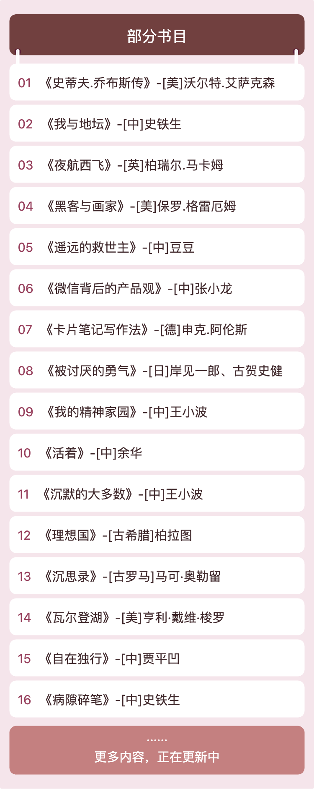

# Y-TOC

一个内容目录海报美化生成工具。

访问：[https://toc.struy.cn/](https://toc.struy.cn/) 使用

觉得有用的话：[打赏一下喝杯水](https://note.mowen.cn/note-intro/?noteUuid=VCM-EtZ94BrA5o4TBc1R3)

别人的付费内容如此有条理和逼格，你也可以快速拥有
1、打开工具页面（电脑、手机都可）

2、填写你的目录内容

3、生成分享图保存

4、作为你的付费内容、课程的总览，逼格满满，诚意满满

最新特性：

1、支持 5 个颜色主题切换

2、支持本地缓存，下次可以接着用

3、新增批量输入目录内容（直接输入整理好的目录，一次粘贴，避免一个个输入，中间插入自动排序

## 生成演示:

## 生成效果预览:

